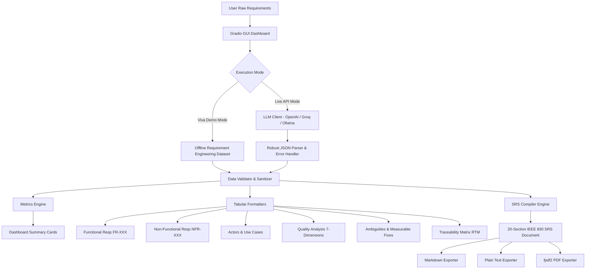

# 🚀 Software Requirement Analysis Agent
### *AI-Powered Requirement Engineering Assistant & IEEE 830 SRS Generator*

[](https://www.python.org/)
[](https://gradio.app/)
[](https://standards.ieee.org/)
[](LICENSE)

---

## 📌 1. Project Overview

In traditional software engineering, requirement gathering and specification drafting are notorious bottlenecks. Raw client requirements are typically ambiguous, incomplete, contradictory, and unstructured. Translating these messy inputs into a formal **Software Requirements Specification (SRS)** document requires days of manual effort by senior business analysts.

The **Software Requirement Analysis Agent** is a desktop GUI-based artificial intelligence system designed to automate and streamline the requirements engineering lifecycle. Built using **Python**, **Gradio**, and state-of-the-art **Large Language Models (LLMs)**, this agent takes raw, unstructured natural language requirements from a user and transforms them into a structured, validated, 20-section IEEE 830 / ISO 29148 compliant SRS document within seconds.

---

## 🎯 2. Objectives

- **Automate Requirement Extraction:** Identify functional and non-functional requirements from informal customer statements without hallucinating facts.
- **Eliminate Ambiguity:** Detect vague requirement smells (*"fast"*, *"user-friendly"*, *"instant"*, *"manage"*) and replace them with measurable, quantifiable acceptance criteria.
- **Enforce Quality Dimensions:** Evaluate requirement sets against 7 industry-standard quality characteristics (Correctness, Completeness, Consistency, Unambiguity, Verifiability, Feasibility, Traceability).
- **Automate Traceability:** Establish bidirectional links between raw input phrases, formal Requirement IDs, priorities, and system use cases.
- **Deliver IEEE 830 Specifications:** Compile complete, professional 20-section SRS documents and export them seamlessly to **PDF**, **Markdown**, and **Plain Text**.
- **Viva-Ready Demonstrability:** Deliver an intuitive GUI with zero external OS dependencies and a built-in offline **Viva Demo Mode** that ensures fail-safe college project presentations.

---

## 🛠️ 3. Technology Stack

| Layer | Technology | Purpose |
|:------|:-----------|:--------|
| **Language** | Python 3.10+ (tested on 3.12) | Core application logic and data processing |
| **User Interface** | Gradio 4.x / 5.x (`gr.Blocks`) | Pure Python reactive web GUI with tabs and metrics |
| **LLM Engine** | OpenAI API (`gpt-4o-mini`, `gpt-4o`, `gpt-3.5-turbo`) | Semantic requirement extraction and IEEE translation |
| **Endpoint Flexibility** | OpenAI-Compatible API Support | Compatible with Groq, Ollama, DeepSeek, OpenRouter |
| **Environment Config** | `python-dotenv` | Secure API key and endpoint management |
| **Document Export** | `fpdf2` (Pure Python) | Header/footer-styled, cross-platform PDF generation |
| **Data Structures** | `pandas` | Interactive tabular presentation of requirements and matrices |

---

## 🏗️ 4. System Architecture



---

## ✨ 5. Key Features

### 1. Raw Requirement Ingestion & Quick Samples
- Large multi-line text input with 1-click loading for 3 realistic scenarios:
  1. **🍕 Online Food Delivery Platform (QuickBite)**
  2. **🏥 Integrated Hospital Information System (CarePulse)**
  3. **🎓 Smart Campus Portal (EduSphere)**

### 2. Comprehensive Requirement Classification
- **Functional Requirements (`FR-XXX`):** Grouped by category (Authentication, Catalog, Payments, etc.) with explicit priority (High/Medium/Low) and engineering rationale.
- **Non-Functional Requirements (`NFR-XXX`):** Classified into Performance, Security, Reliability, Scalability, and Usability with **concrete, testable acceptance metrics**.

### 3. Ambiguity & Defect Detection
- Automatically identifies vague adjectives and verbs that cannot be objectively verified during QA testing.
- Maps each ambiguous phrase to the specific defect and provides an **improved, measurable requirement statement**.

### 4. 7-Dimension Requirement Quality Evaluation
Evaluates the requirement set against the core IEEE 830 quality attributes:
1. **Correctness**
2. **Completeness**
3. **Consistency**
4. **Unambiguity**
5. **Verifiability**
6. **Feasibility**
7. **Traceability**

### 5. Actor & Use Case Extraction
- Identifies system user classes and roles.
- Constructs formal use cases complete with Preconditions, Main Success Flow steps, and Postconditions.

### 6. Bidirectional Traceability Matrix (RTM)
- Maps `Requirement ID` $\rightarrow$ `Requirement Summary` $\rightarrow$ `Source Input Statement` $\rightarrow$ `Type` $\rightarrow$ `Priority` $\rightarrow$ `Related Use Case`.

### 7. 20-Section IEEE 830 / ISO 29148 SRS Document
Generates the complete 20-section specification:
1. Introduction
2. Purpose
3. Scope
4. Definitions, Acronyms, and Abbreviations
5. Overall Description
6. Product Perspective (including ASCII Architecture Diagram)
7. User Classes and Characteristics
8. Functional Requirements
9. Non-Functional Requirements
10. External Interface Requirements (UI, Hardware, Software, Communication)
11. Data Requirements & Schema Entities
12. Business Rules
13. Assumptions and Dependencies
14. Constraints
15. Security Requirements
16. Performance Requirements
17. Potential Risks and Mitigation Strategies
18. Use Cases & System Workflows
19. Ambiguous and Missing Requirements Analysis
20. Traceability Matrix

### 8. Multi-Format Document Export
- **PDF (.pdf):** Styled with navy blue headers, document metadata, page numbers (*"Page X of Y"*), and clean bordered tables using pure Python `fpdf2`.
- **Markdown (.md):** GitHub-flavored markdown with anchor links and formatted tables.
- **Plain Text (.txt):** Clean, stripped text file suitable for printing or terminal viewing.

---

## 📂 6. Project Structure

```
software-requirement-analysis-agent/
│
├── app.py                      # Main Gradio application & event handlers
├── requirements.txt            # Python dependencies
├── .env                        # Local API key configuration (git-ignored)
├── .env.example                # Example environment template
├── README.md                   # Complete project documentation & viva guide
│
├── src/                        # Modular source code
│   ├── __init__.py             # Package marker
│   ├── prompts.py              # IEEE 830 system prompts & JSON schemas
│   ├── analyzer.py             # LLM orchestrator, JSON parsing & demo datasets
│   ├── srs_generator.py        # 20-section SRS document compiler
│   ├── validators.py           # Data validation, metrics & pandas formatters
│   └── exporters.py            # PDF (fpdf2), Markdown & TXT export generators
│
├── examples/
│   └── sample_requirements.txt # 3 diverse college-grade demo requirements
│
└── outputs/                    # Auto-generated SRS files (.pdf, .md, .txt)
```

---

## ⚡ 7. Installation & Setup

### Prerequisites
- Python 3.10 or higher installed on your system.
- Git (optional).

### Step 1: Clone or Navigate to Project Directory
```bash
cd d:/Shivam/flexi-ca3
```

### Step 2: Create a Virtual Environment (Recommended)
```bash
# Windows
python -m venv venv
.\venv\Scripts\activate

# Linux / macOS
python3 -m venv venv
source venv/bin/activate
```

### Step 3: Install Dependencies
```bash
pip install -r requirements.txt
```

### Step 4: Configure API Key (Optional for Viva Demo Mode)
Create a `.env` file from `.env.example`:
```bash
copy .env.example .env
```
Open `.env` and add your OpenAI API key:
```ini
OPENAI_API_KEY=sk-proj-your_actual_key_here
MODEL_NAME=gpt-4o-mini
```

*(Note: If you do not have an OpenAI API key, you can still run the application in **Viva Demo Mode** with 100% functionality!)*

---

## 🖥️ 8. How to Run

Launch the application with a single command:
```bash
python app.py
```

Once started, open your browser and navigate to:
```
http://127.0.0.1:7860
```

---

## 🎓 9. College Viva Demonstration Flow

Follow this step-by-step sequence during your project evaluation:

| Step | Action | Viva Talking Point |
|:-----|:-------|:-------------------|
| **1** | Open `http://127.0.0.1:7860` in the browser. | *"This is our AI-powered Software Requirement Engineering Agent built using Python and Gradio."* |
| **2** | Click **"🍕 Food Delivery"** quick loader. | *"We ingest raw, unstructured client statements that contain implicit and ambiguous requirements."* |
| **3** | Click **"🚀 Analyze Requirements"**. | *"The agent parses the text through a specialized IEEE 830 prompt, categorizing requirements and generating dashboard metrics."* |
| **4** | Point to the **Dashboard Metric Cards**. | *"Notice the real-time summary: Total Requirements, Functional vs Non-Functional counts, Ambiguities detected, and High Priority tasks."* |
| **5** | Switch to **"⚙️ Functional Requirements"** tab. | *"Each requirement is assigned a formal ID (FR-001), category, priority, and rationale justifying its inclusion."* |
| **6** | Switch to **"🛡️ Non-Functional Requirements"** tab. | *"Unlike vague client requests, each NFR includes a quantifiable acceptance threshold (e.g., latency <= 1500ms)."* |
| **7** | Switch to **"👥 Actors & Use Cases"** tab. | *"The agent extracts distinct system actors and builds formal use case sequences with preconditions and postconditions."* |
| **8** | Switch to **"⚠️ Ambiguities"** & **"✨ Improved Requirements"** tabs. | *"Here the agent detects 'requirement smells'—such as the vague term 'fast'—and reformulates it into testable criteria."* |
| **9** | Switch to **"🔍 Quality Analysis"** tab. | *"We evaluate the requirement set against the 7 standard IEEE quality dimensions: Correctness, Completeness, Consistency, etc."* |
| **10** | Switch to **"📋 Traceability Matrix"** tab. | *"The Requirement Traceability Matrix (RTM) links each requirement back to its original source sentence and use case."* |
| **11** | Switch to **"📄 SRS Document"** tab and click **"📝 Generate SRS Document"**. | *"The agent compiles a full 20-section IEEE 830 specification document."* |
| **12** | Click **"Download Formatted PDF"**. | *"The SRS is exported into a professionally styled PDF with headers, footers, and page numbers."* |

---

## 🔬 10. Software Engineering Concepts Implemented

1. **IEEE 830-1998 & ISO/IEC/IEEE 29148 Standards:** The industry benchmarks for structuring software requirement specifications.
2. **Requirement Smells & Ambiguity Elimination:** Detecting non-verifiable words (*"easy"*, *"fast"*, *"robust"*) that lead to project failure during user acceptance testing (UAT).
3. **Requirement Traceability Matrix (RTM):** Ensuring no requirement is orphaned and all features trace directly back to client business needs.
4. **Separation of Concerns:** Functional capabilities (what the system does) vs. Non-Functional constraints (how well the system performs).
5. **Defensive AI Engineering:** Enforcing strict JSON schema responses, handling API exceptions gracefully, and providing a deterministic offline fallback.

---

## ⚠️ 11. Project Limitations

- **Complex Domain Knowledge:** Highly specialized domains (e.g., medical device firmware or aviation avionics) require custom fine-tuned models or external ontologies.
- **Natural Language Subjectivity:** The quality of the analysis is bounded by the clarity and context provided in the raw input.
- **Single-Turn Analysis:** The current version performs batch analysis rather than an iterative multi-turn conversational elicitation.

---

## 🔮 12. Future Scope

- **Visual UML Diagram Generation:** Automatically render PlantUML / Mermaid Use Case and Sequence diagrams in the GUI.
- **Jira / GitHub Issues Integration:** One-click export of extracted Functional Requirements directly into agile backlog boards.
- **Multi-Turn Requirement Elicitation:** An interactive chatbot mode where the AI asks clarifying questions to resolve missing requirements.
- **Multi-Language Support:** Ingesting and analyzing software requirements in regional languages.

---

## 📄 13. License

Distributed under the **MIT License**. Free for academic, educational, and research use.
